# Aplicativo Gestor Fatec Eats

### Sobre
Aplicativo gestão de pedidos de restaurantes.

### Tecnologia
Projeto Android desenvolvido com a linguagem java utilizando persistência de dados o Firebase com firestore através de coleções e documentos, para autenticação foi utilizado o método de email/senha (Authentication) do firebase.
 
 ### Recursos extras
 - Adicionado biblioteca Firebase-Auth para realizar autenticação e registros dos usuários
 - Adicionado biblioteca Glide para exibir imagens externas

### Funcionalidades 
 - Criar conta gestor do restaurante
 - Adicionar e editar dados do restaurante
 - Configurar logotipo do restaurante
 - Efetuar login com a conta de gestor
 - Listagem de restaurantes
 - Adicionar, editar categorias
 - Listagem de categorias
 - Adicionar, editar produtos
 - Listagem de produtos
 - Adicionar, editar publicidade
 - Listagem de publicidade
 - Listagem de pedidos

 

### Telas do App

    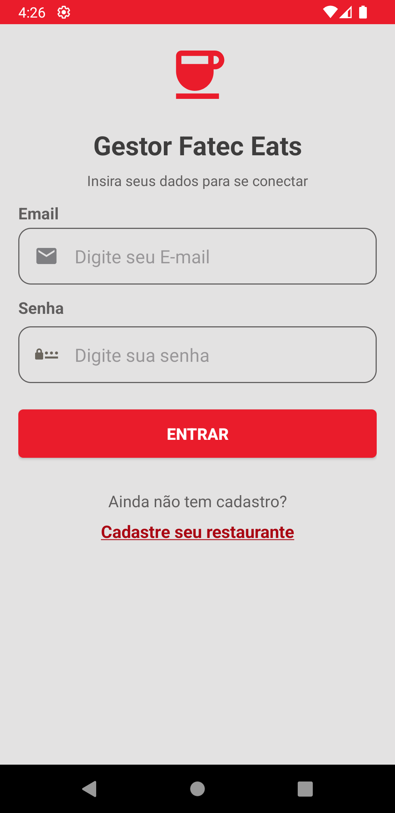
    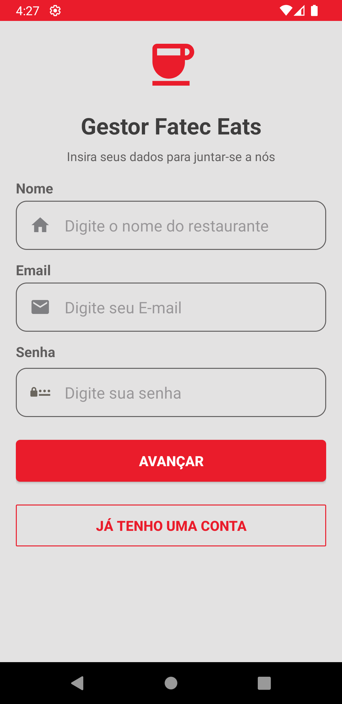
    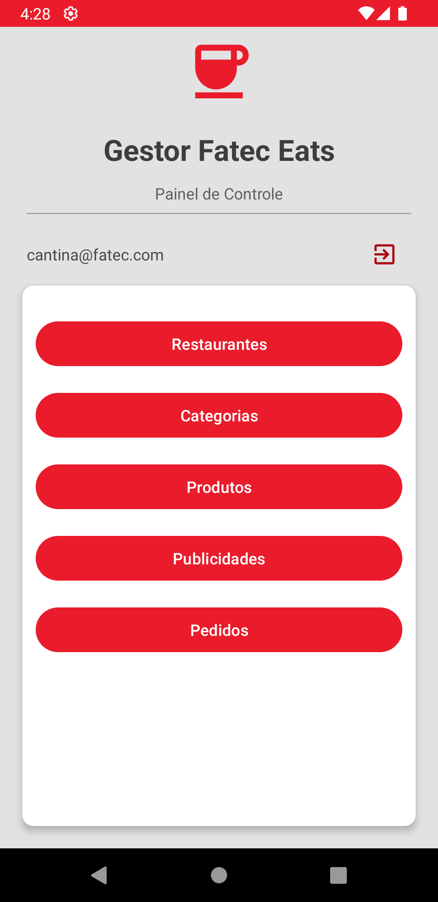
    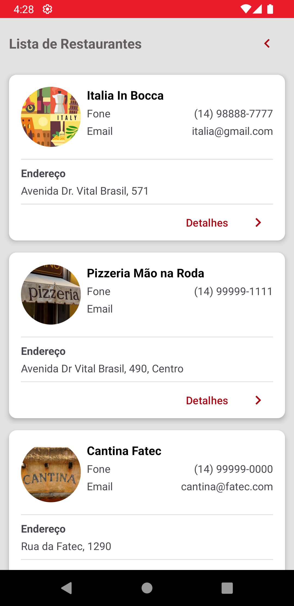
    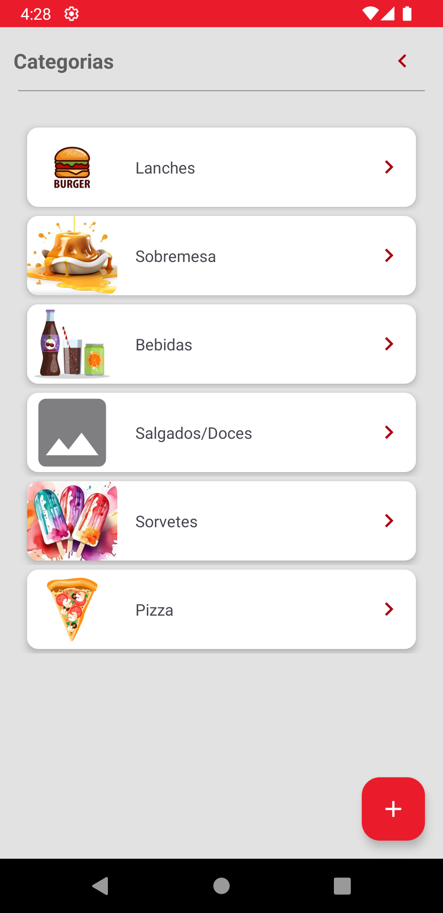
    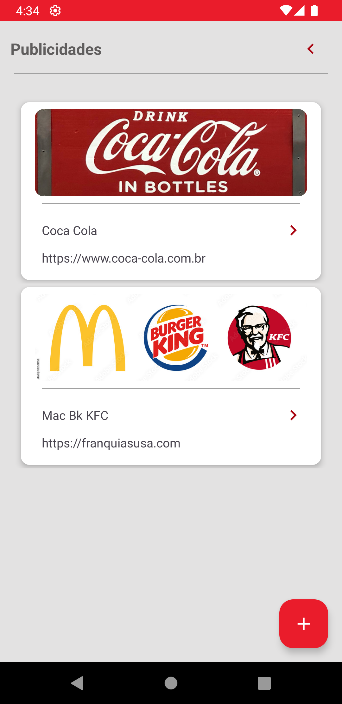   

### Telas das Collections

    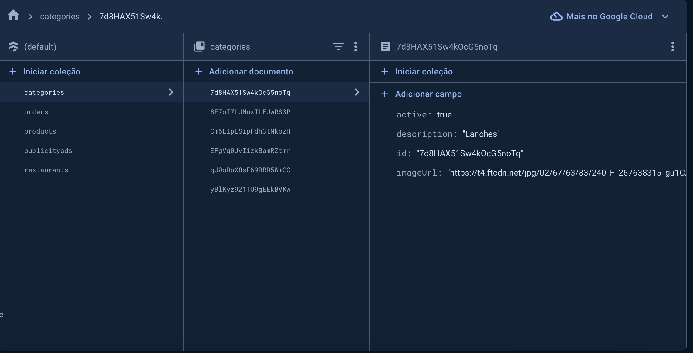
    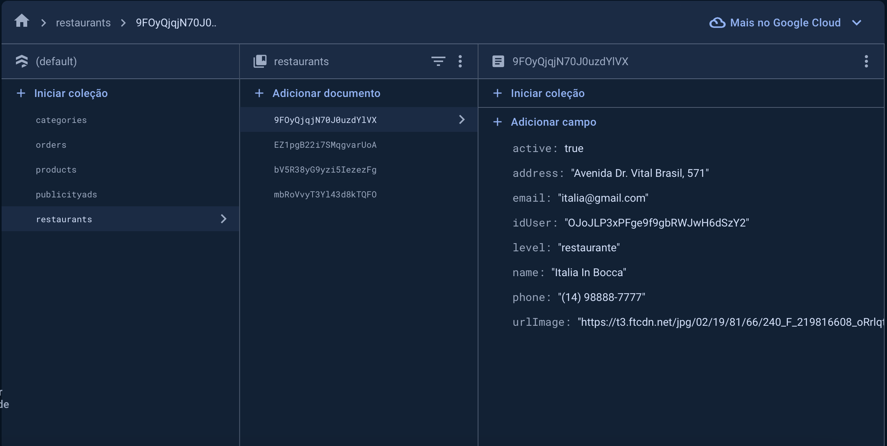
    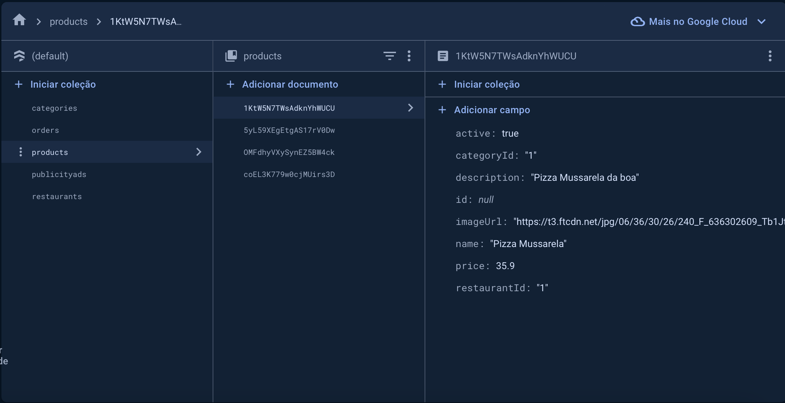
    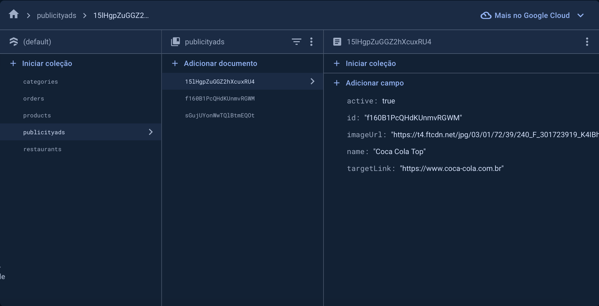
    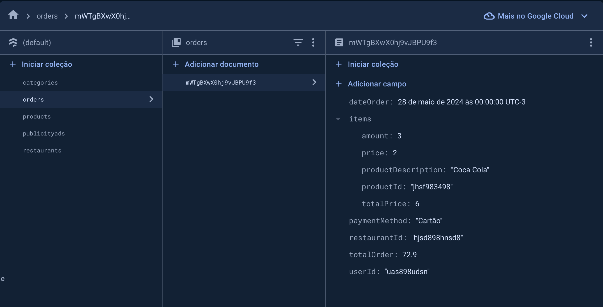   

